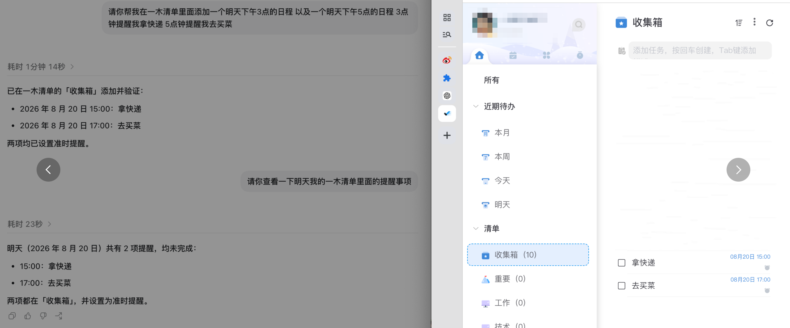
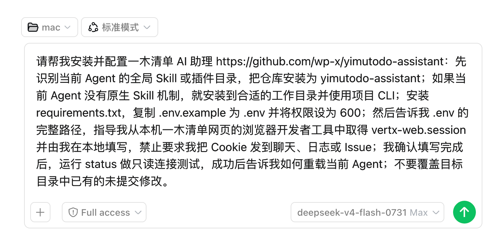
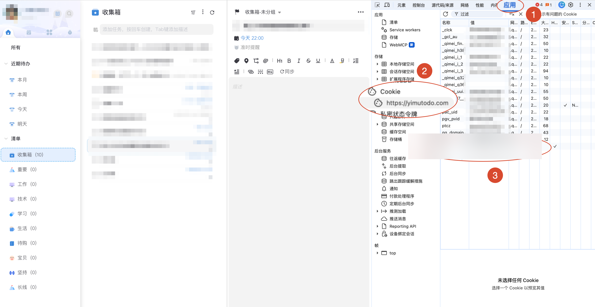
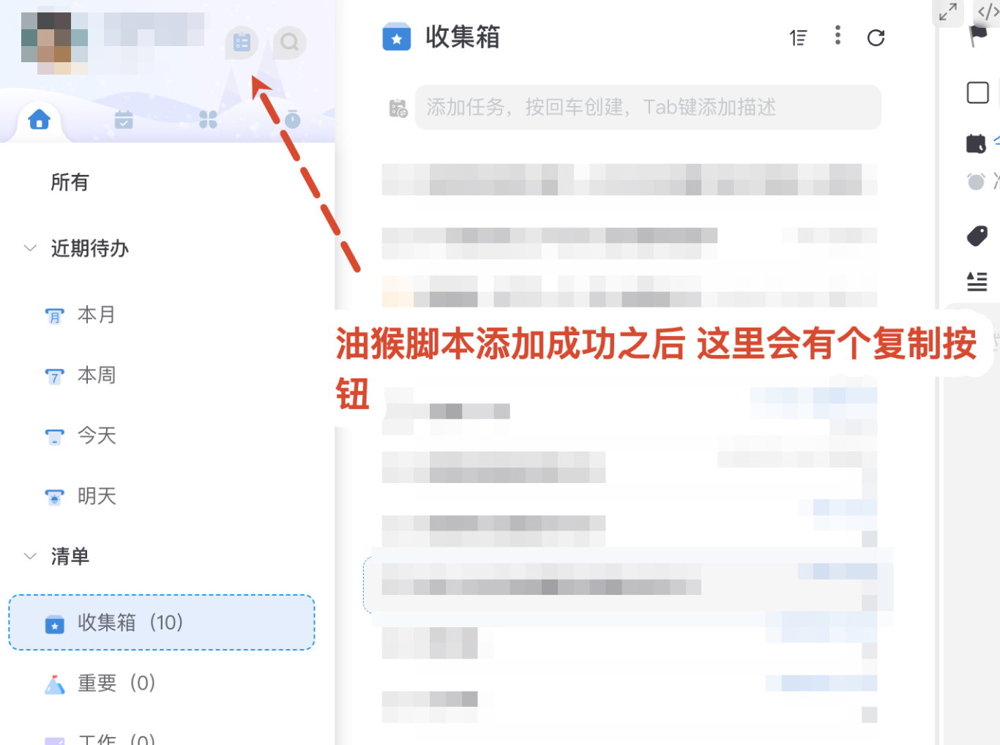

# 一木清单 AI 助理

让 AI Agent 通过非官方 API 查询和管理一木清单。支持自然语言触发，也可以单独使用命令行工具。



> 本项目来自网页端接口逆向，与一木清单官方无关。接口升级后可能失效。

## 一句话安装

复制下面整段，发给 Codex、Claude Code、Kimi、zcode 或其他能执行命令的 Agent：


```text
请帮我安装并配置一木清单 AI 助理 https://github.com/wp-x/yimutodo-assistant：先识别当前 Agent 的全局 Skill 或插件目录，把仓库安装为 yimutodo-assistant；如果当前 Agent 没有原生 Skill 机制，就安装到合适的工作目录并使用项目 CLI；安装 requirements.txt，复制 .env.example 为 .env 并将权限设为 600；然后告诉我 .env 的完整路径，指导我从本机一木清单网页的浏览器开发者工具中取得 vertx-web.session 并由我在本地填写，禁止要求我把 Cookie 发到聊天、日志或 Issue；我确认填写完成后，运行 status 做只读连接测试，成功后告诉我如何重载当前 Agent；不要覆盖目标目录中已有的未提交修改。
```

## 能做什么

- 查询、创建、修改和完成任务
- 管理项目、标签、任务组、提醒、习惯和打卡
- 识别“明天下午三点”这类中文时间
- 查询回收站和专注记录
- 通过“一木清单”“帮我记个待办”等自然语言触发

例如：

```text
帮我在一木清单添加一个明天下午三点取快递的任务。
查看一木清单里还没完成的任务。
把“取快递”标记为完成。
```

说出“一木清单”可以减少 Agent 把请求误判成系统日历或浏览器操作。

## 手动安装

需要 Python 3.10 或更高版本。以通用 Agent 目录为例：

```bash
git clone https://github.com/wp-x/yimutodo-assistant.git ~/.agents/skills/yimutodo-assistant
cd ~/.agents/skills/yimutodo-assistant
python3 -m pip install -r requirements.txt
cp .env.example .env
chmod 600 .env
```

登录 [一木清单网页版](https://www.yimutodo.com)，按 `F12` 打开开发者工具，在 Application（应用）→ Cookies 中找到 `vertx-web.session`，填入 `.env`。


```dotenv
YIMUTODO_COOKIE='vertx-web.session=替换为你自己的值'
```

Cookie 等同于登录状态。项目已通过 `.gitignore` 排除 `.env`，仍需避免把它粘贴到聊天、Issue、截图或公开仓库。



`yimutodo_cookie_tools/` 提供了可选油猴脚本。只读取一木清单域名下的 session 并复制到剪贴板。不了解油猴权限时，使用开发者工具手动复制。

## 命令行

```bash
python3 scripts/yimutodo_cli.py status
python3 scripts/yimutodo_cli.py projects
python3 scripts/yimutodo_cli.py tasks --status open
python3 scripts/yimutodo_cli.py add-task "取快递"
python3 scripts/yimutodo_cli.py complete TASK_ID
```

完整接口与字段见 [API 参考](references/api-reference.md)。

## 使用限制

- Cookie 过期时会返回 `errorCode=1000004`，重新登录并更新 `.env` 即可。
- 提醒、重复和打卡需要严格的字段组合与毫秒时间戳。
- 所有写入都会直接修改用户的真实数据。
- 不同 Agent 的 Skill 目录和自动触发机制可能不同，CLI 可以独立运行。

## License

[MIT](LICENSE)
